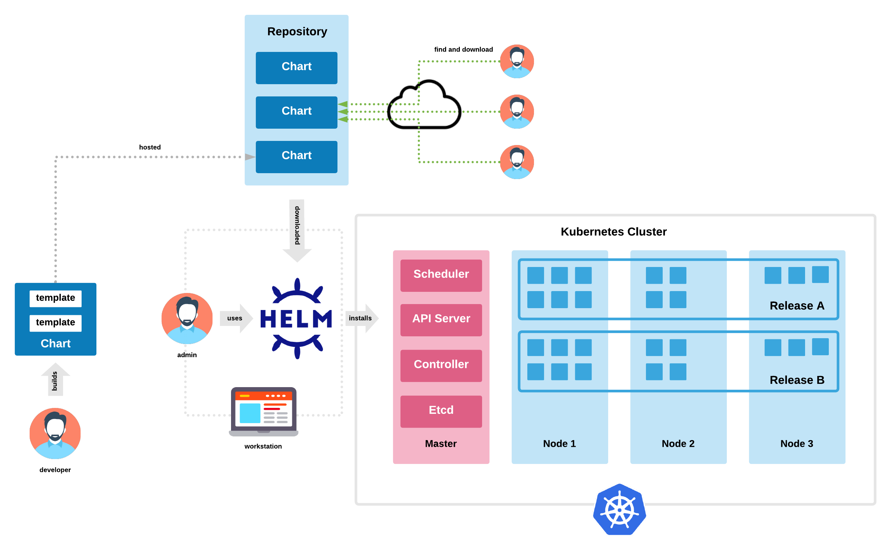
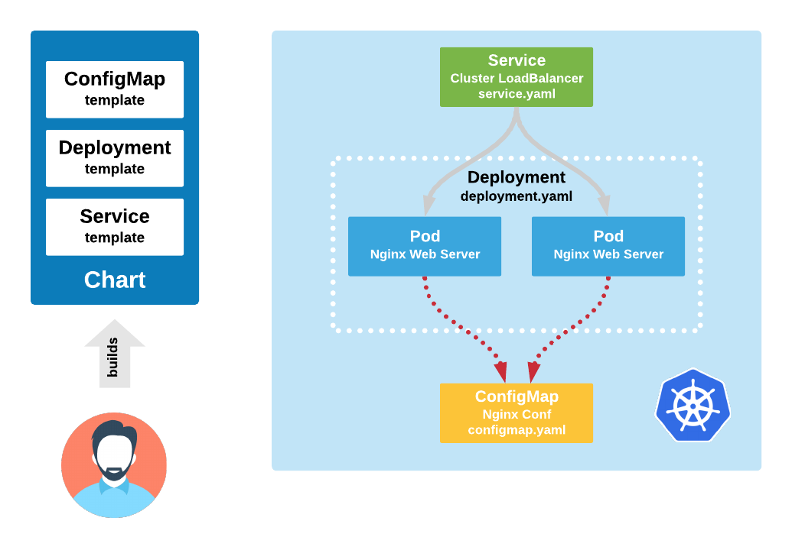

# Helm Chart Demonstration Resources

The following instructions are used to demonstrate how to build, package, and install a Helm 3 custom chart.



The custom ```cloudacademy-webapp``` Helm chart when installed creates the following cluster resources:



:metal:

# STEP 1:
Package the ```cloudacademy-webapp``` chart

```
helm package cloudacademy-webapp
```

# STEP 2:
Install the ```cloudacademy-webapp``` chart into Kubernetes cluster

Note: assumes that you have a cluster credentials configured within your local ```~/.kube/config``` file

```
helm install ca-demo1 cloudacademy-webapp-0.1.0.tgz
```

# STEP 3:
Examine newly created Helm chart release, and all cluster created resources

```
helm ls

kubectl get all
```

# STEP 4:
Perform an HTTP GET request, send it to the newly created cluster service and confirm that the response containse the ```CloudAcademy DevOps 2020 v1``` message stored in the ```values.yaml``` file

```
kubectl run --image=busybox bbox1 --rm -it --restart=Never \
-- /bin/sh -c "wget -qO- http://ca-demo1-cloudacademy-webapp"
```

# STEP 5:
Perform a Helm upgrade on the ```ca-demo1``` release

```
helm upgrade ca-demo1 cloudacademy-webapp-0.1.0.tgz \
--set nginx.conf.message="Helm Rocks"
```

# STEP 6:
Perform another HTTP GET request. Confirm that the response now has the updated message ```Helm Rocks```

```
kubectl run --image=busybox bbox1 --rm -it --restart=Never \
-- /bin/sh -c "wget -qO- http://ca-demo1-cloudacademy-webapp"
```

# STEP 7:
Examine the ```ca-demo1``` release history

```
helm history ca-demo1
```

# STEP 8:
Rollback the ```ca-demo1``` release to previous version

```
helm rollback ca-demo1
```

# STEP 9:
Perform another HTTP GET request. Confirm that the response has now been reset to the ```CloudAcademy DevOps 2020 v1``` message stored in the ```values.yaml``` file

```
kubectl run --image=busybox bbox1 --rm -it --restart=Never \
-- /bin/sh -c "wget -qO- http://ca-demo1-cloudacademy-webapp"
```

# STEP 10:
Uninstall the ```ca-demo1``` release

```
helm uninstall ca-demo1
```